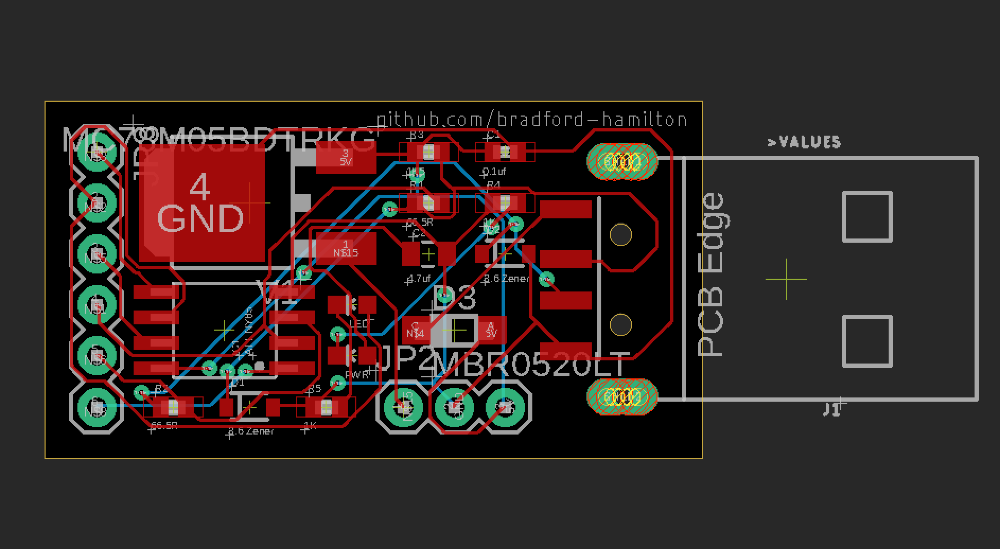
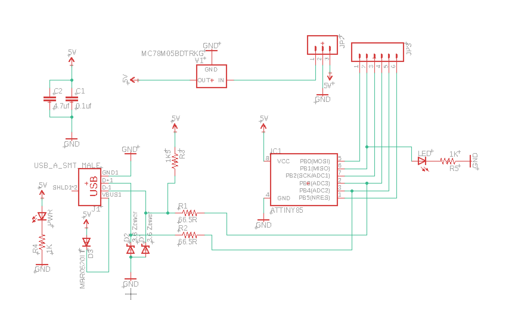
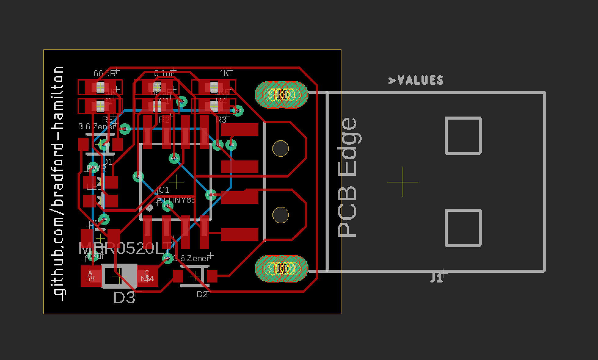
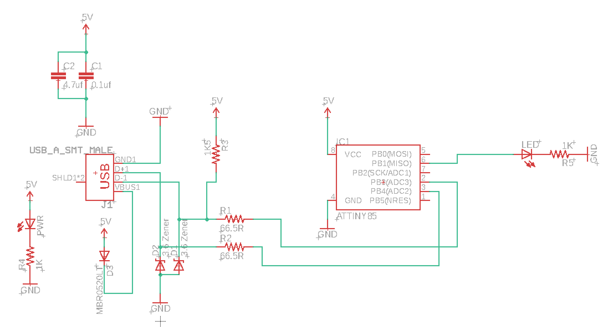

First go at building a usb development board using the [ATtiny85](https://www.microchip.com/wwwproducts/en/ATtiny85). I took a [digispark](http://digistump.com/products/1) schematic, modified it to use a [USB Male Type A Connector](https://www.sparkfun.com/products/437), two 1kΩ resistors (where they were blank), placed components on a relatively small footprint, and set up the traces.

The ATtiny85 must be flashed with [micronucleus](https://github.com/micronucleus/micronucleus) (occupies 2kB out of the 8kB flash) to have the ability to be compatible with Arduino's IDE (specifically to be used as a Digispark board). Micronucleus implements [V-USB](https://www.obdev.at/products/vusb/index.html) which is a software-only implementation of a low-speed USB device. Created on [Eagle](https://www.autodesk.com/products/eagle/free-download). Project includes board (.brd), schematic (.sch), a BOM, and all gerber & drill files.

__Status__: Just ordered a handful of them off [PCBWay](https://www.pcbway.com/). Will update if they work!

___

#### Board with pins v1

#### Schematic with pins v1

___

#### Board with pins v1

#### Schematic with pins v1
